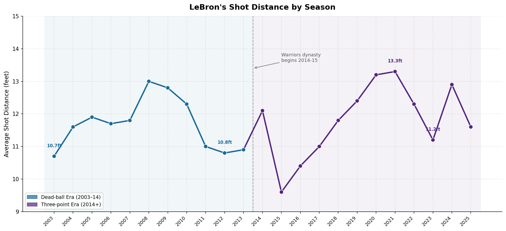
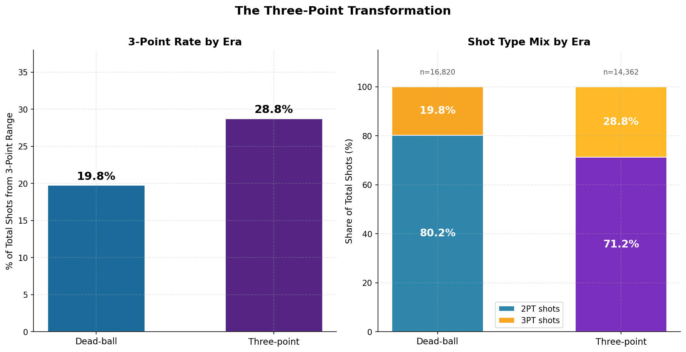
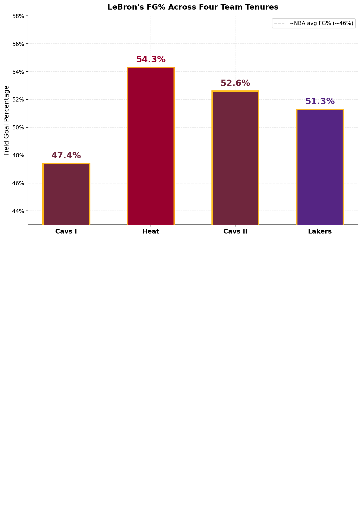
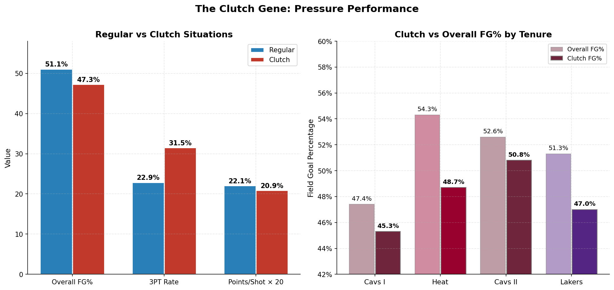
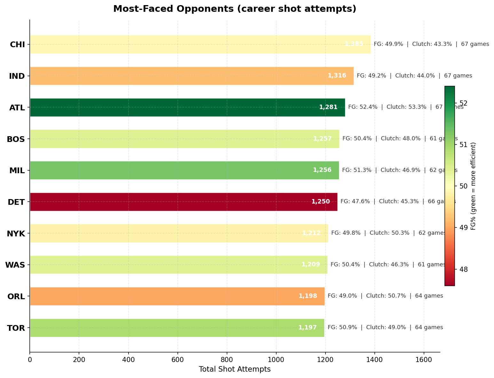
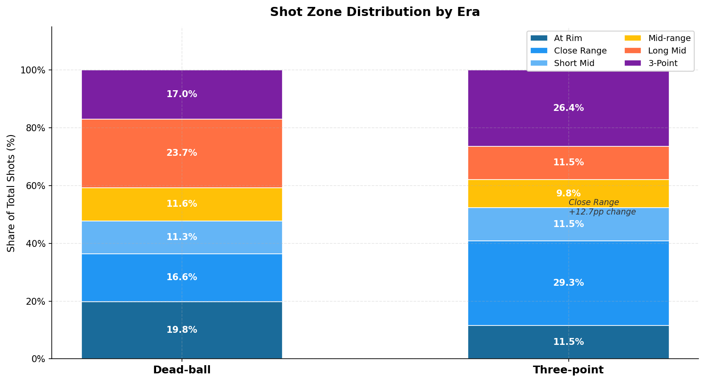
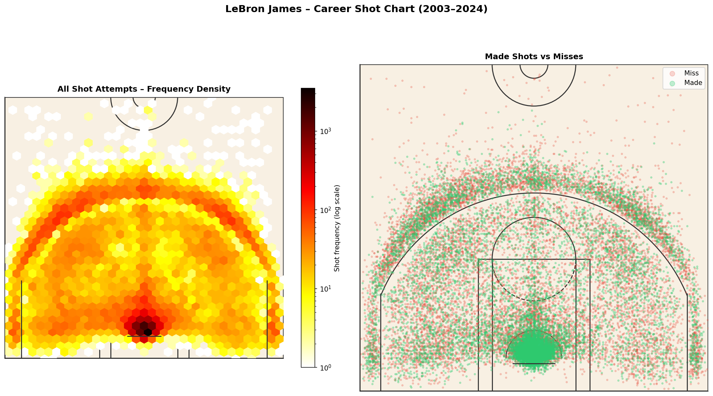
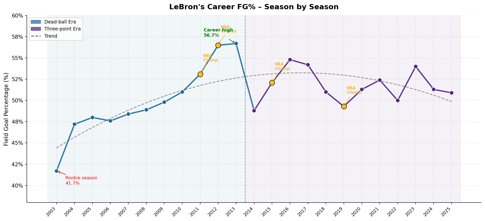
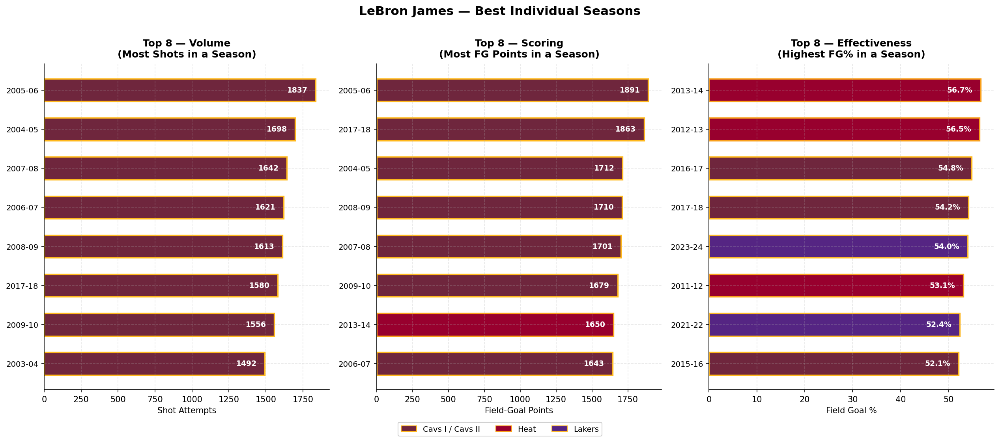

# Lebron James Shot Analytics

**A look at lebron's shot data from the past 20 years.**

---

## Intro

When people debate LeBron James, the conversation usually lands on rings, MVP awards, and the Jordan comparison. Those arguments generate a lot of noise. What the shot-by-shot data actually shows — across 21 seasons — is something more specific: a player who didn't just survive one of the most dramatic style shifts in NBA history, he adjusted to it and got better.


This analysis covers every regular season shot attempt from 2003-04 through 2023-24 — 31,182 attempts across four teams and four distinct career chapters. It doesn't settle the GOAT debate. It answers something narrower: how has his shooting profile changed over two decades, how does he hold up under pressure, and which opponents have given him the most trouble?

---

## Stats

Across 1,594 regular season games and 23 seasons, LeBron attempted 31,182 shots and made 15,786 — a 50.6% clip that puts him among the most efficient high-volume scorers the league has seen. Those makes generated 34,178 points from the field alone.

| Metric | Value |
|--------|-------|
| Total shot attempts | 31,182 |
| Field goals made | 15,786 |
| Overall FG% | **50.6%** |
| Points from shots | 34,178 |
| Games played | 1,594 |
| Seasons | 23 |
| Avg shot distance | 11.7 ft |

The NBA average FG% sits around 46-47%. LeBron has shot 3-4 points above that his entire career — while handling a massive usage rate, taking plenty of contested mid-range attempts in his early years, and still playing heavy minutes at 39.

The 11.7-foot average shot distance is the detail that doesn't get enough attention. That's deep mid-range — not a rim-runner's number, not a perimeter specialist's. It's a player who's spent two decades operating in the contested middle of the court and been effective there.

---

## Dead-ball vs 3PT era

The league's transformation didn't happen in a single offseason, but 2014-15 — when Curry's Warriors won the title and the analytics crowd finally got the validation they'd been waiting for — is the cleanest dividing line.


*Figure 1: LeBron's average shot distance by season. Era shading shows the transition point at 2014-15.*

### Dead-Ball Era (2003–2014): Building the Foundation

In his first 11 seasons, 80.2% of LeBron's attempts were 2-pointers. That wasn't stubbornness — the pre-analytics NBA rewarded mid-range mastery, post-ups, and paint production. Three-pointers were a supplemental weapon, not a primary one.

His FG% over this stretch: **49.6%**. That number undersells the Miami years. In his final three Dead-ball seasons (2011-12 through 2013-14), he shot 53.1%, 56.5%, and 56.7% — a three-year run of efficiency that almost no high-usage player in modern history has matched.

| Dead-Ball Era Stats | Value |
|--------------------|-------|
| Total shots | 16,820 |
| FG% | 49.6% |
| 2PT shot rate | 80.2% |
| 3PT shot rate | 19.8% |
| Points per shot | 1.06 |

The 2011-12 and 2012-13 Miami seasons represent the peak of LeBron as a mid-range player. He wasn't launching threes at the Warriors' rate; he was working the paint, the elbow, and the floater game. Harder to maintain across 82 games, but the numbers were elite.

### Three-Point Era (2014–Present): The Adjustment

When LeBron came back to Cleveland in 2014, the league had moved. Teams were publishing shot quality reports. Mid-range jumpers — even the ones LeBron was draining — showed up as "below average" expected value. The Cavs built a wide-open roster around him, and his shot profile shifted to match.

His three-point rate climbed from 22.6% in 2013-14 to 26.5% in his first year back in Cleveland, then kept moving — hitting a career-high **36.7% in 2021-22**.


*Figure 2: Three-point rate and shot type mix by era.*

| Three-Point Era Stats | Value |
|----------------------|-------|
| Total shots | 14,362 |
| FG% | **51.8%** |
| 2PT shot rate | 71.2% |
| 3PT shot rate | 28.8% |
| Points per shot | 1.138 |

More threes and a higher overall FG% — that's the part that surprises most people. Taking more long shots improved his efficiency because the shots he replaced weren't good ones to begin with. Long mid-range pull-ups (17-23 feet) are the worst shot in basketball. He traded those for three-point attempts at 35.6%, which at 1.07 expected points per attempt beats a 45% long two-pointer every time.


---

## Team by Team


*Figure 3: FG% across four team tenures with total shot volume and three-point rate.*

### Chapter 1: Cleveland Cavaliers I (2003–2010) — The Prodigy

**47.4% FG | 20.5% 3PT rate | 11,459 shots | 548 games**

Seven seasons in Cleveland with teams that mostly weren't good enough. The shooting numbers show a player still figuring things out. His rookie FG% of 41.7% in 2003-04 is the lowest of his career, which makes the trajectory — up to 49.8% by 2009-10 — more impressive than the end number alone suggests.

By his final Cavs I season, he was averaging 12.8 feet per shot — longer than his current average, which means more pull-up jumpers and fewer plays finishing at the rim. The efficiency was solid for the era but not yet elite. He was getting better every year, and the best version of him was still a few years away.

### Chapter 2: Miami Heat (2010–2014) — The Champion

**54.3% FG | 18.4% 3PT rate | 5,361 shots | 294 games**

His most efficient chapter, and it's not close. 54.3% across four seasons, with the final two years at 56.5% and 56.7%. Spoelstra's system was built around LeBron attacking the paint and collapsing defenses for Bosh and Wade on the kick-out. Threes were for the supporting cast. LeBron got to operate in the spots where he shoots 58%+ from 2-point range.

The three-point rate actually dropped to 18.4% — lower than Cavs I. That wasn't regression; it was a deliberate tactical choice that paid off in historically efficient shooting.

Home/away split: 55.3% at home, 53.4% away. The gap is small, which means he wasn't getting carried by friendly rims. He was just that good everywhere.

### Chapter 3: Cleveland Cavaliers II (2014–2018) — The Return

**52.6% FG | 24.3% 3PT rate | 5,631 shots | 301 games**

Coming back to Cleveland meant coming back to a different NBA. The Cavs surrounded him with shooters, and his three-point rate jumped to 24.3% — then higher in his last two seasons there. The 2-point efficiency held: 58.2% from 2-point range, matching Miami despite taking more volume from deep.

His clutch FG% during this tenure — 50.8% — was the best of any chapter. The 2016 Finals numbers are in here somewhere, the block and the chase-down layup and everything else. The data holds up.

### Chapter 4: Los Angeles Lakers (2018–Present) — The Legend

**51.3% FG | 31.7% 3PT rate | 8,731 shots | 451 games**

The Lakers era is the most three-point heavy period of his career. The rate climbed steadily: 29.9%, 32.6%, 34.1%, 36.7%, then settled back around 29-31% in his late 30s. This is just the league he plays in now — even at 39, he's taking a higher proportion from deep than at any point in his first decade.

The 2-point efficiency: 58.5%, slightly above Miami. He's not taking more threes because his paint production dried up. He's taking more threes because that's how the league plays now, and his finishing ability at the rim hasn't gone anywhere.

---

## Clutch Gene


*Figure 4: Clutch vs regular performance — overall metrics and by-tenure breakdown.*

In 3,822 clutch situations (last 5 minutes of 4th quarter or OT), LeBron shot **47.3%**. In 27,360 regular situations, he shot **51.1%**. That's a 3.8 percentage point gap.

| Situation | Shots | FG% | 3PT Rate | Points/Shot |
|-----------|-------|-----|----------|-------------|
| Regular | 27,360 | 51.1% | 22.9% | 1.103 |
| Clutch | 3,822 | 47.3% | 31.5% | 1.044 |

Two things are worth keeping in mind when looking at that gap. First, he takes significantly more threes in clutch situations — 31.5% vs 22.9% in regular play. Shifting to a lower-percentage shot (35% from three vs ~55% on 2-pointers) pulls FG% down arithmetically even if the shot selection is defensible. The points-per-shot gap is smaller than the FG% gap: 1.044 clutch vs 1.103 regular.

Second, on final possessions — last 24 seconds, actual game-winners — he shot 38.6% on 497 attempts. That's a real sample size, and 38.6% on contested shots with the defense built specifically to stop you is not a collapse. Most NBA stars shoot worse in the same situation.

By tenure: Cavs II (50.8%) is his best clutch percentage — nearly identical to his regular-time efficiency during that chapter. Heat (48.7%) held up well. Cavs I (45.3%) and Lakers (47.0%) show more of a drop.

The honest read: yes, he's slightly worse under pressure. So is almost everyone. The gap is real but the reputation overstates it.

---

## Opponent Analysis


*Figure 5: Most-faced opponents by career shot attempts. Color indicates FG% — green is efficient, red is tougher.*

LeBron's most-faced opponents are almost all Eastern Conference teams from his Cleveland and Miami years. Chicago (1,385 shots, 67 games), Indiana (1,316), Atlanta (1,281), and Boston (1,257) sit at the top. Multiple playoff series against those teams — the 2006-2010 Cavs-Pistons-Bulls wars, the Pacers rivalry — account for the volume.

### Best Matchups (min. 100 shots)

| Opponent | FG% | Shots |
|----------|-----|-------|
| Brooklyn (BKN) | 56.9% | 603 |
| Charlotte (CHA) | 53.9% | 1,147 |
| Portland (POR) | 53.3% | 913 |
| New Orleans (NOP) | 53.0% | 658 |

Charlotte at 53.9% on 1,147 shots is the biggest statement — that's a large, reliable sample over 20 years. The Hornets have never had a real answer for him.

### Toughest Matchups (min. 100 shots)

| Opponent | FG% | Shots |
|----------|-----|-------|
| LA Clippers (LAC) | 47.4% | 998 |
| Detroit (DET) | 47.6% | 1,250 |
| Houston (HOU) | 48.5% | 927 |

The Clippers (47.4% on 998 shots) are his worst large-sample matchup. The Detroit number (47.6% on 1,250 shots) goes back to the Pistons' "LeBron Rules" defense from the 2005-2008 playoff series — physical, gang-defensive, and it clearly worked. Houston's scheme under multiple coaches has consistently created problems.

Home/away: LeBron shoots about 1.5-2 points better at home across opponents. Typical for NBA stars, but relevant if you're a team thinking about giving up home-court advantage.

---

## Shot Selection Evolution


*Figure 6: Shot zone distribution by era. Long mid-range attempts were nearly cut in half.*

### The Court Map


*Figure 7: Career shot frequency (left) and made vs missed shots (right).*

The density map shows what you'd expect for LeBron: heavy concentration around the restricted area and in the paint, a secondary cluster at the elbow and wing mid-range, and a third band at the three-point line — particularly the corners. The made/missed overlay shows his best accuracy zones clearly — the restricted area is almost entirely green.

### What Moved

**At Rim** (0 ft): Down from 19.8% to 11.5%. Not athleticism declining — it's defenses loading up the paint differently in the Three-point era, plus the math of more shots coming from further out.

**Long Mid-range** (17-23 ft): Dropped from 23.7% to 11.5%. This is the analytics revolution in one number. Those pull-up 20-footers were gone from his chart by 2016 once the Cavs coaching staff and his own film work aligned on shot quality.

**Three-pointers** (24+ ft): Up from 17.0% to 26.4%. The whole story of how offensive basketball changed, compressed into a single data point.

---

## Career Trajectory


*Figure 8: Season-by-season FG% with championship years marked and a quadratic trend line.*

The career arc has three distinct phases. A steep climb from the rookie year (41.7% in 2003-04) through the Miami peak (56.7% in 2013-14). A pullback when he returned to Cleveland and started shooting more threes. Then a stabilization in the Lakers era at 49-54%.

The 2013-14 season (56.7%) is the career high — one of the five best FG% seasons ever recorded for a player averaging 25+ points per game. That's the outlier. The rest of his Dead-ball career was good but not at that level.

The Lakers years are consistent. The 2023-24 season (54.0%) was his best as a Laker from an efficiency standpoint, and at 39 years old, that's not a maintenance story — it's a quietly impressive one.

**Championship seasons** don't show a consistent FG% spike. Miami 2011-12: 53.1%. Miami 2012-13: 56.5%. Cleveland 2015-16: 52.1%. Lakers 2019-20: 49.3%. Winning doesn't require peak efficiency — it requires enough of it at the right times.

---

## The Best Season


*Figure 9: Top 8 seasons in three dimensions — volume (shots), scoring (field-goal points), and effectiveness (FG%).*

Twenty-three seasons produce a lot of data points. Here's what the peak looks like in each dimension.

### By Volume: 2005-06

LeBron's highest-shot season is 2005-06: **1,837 attempts in 79 games**, 23.3 per night. Every top-5 volume season comes from Cavs I. The pattern isn't hard to explain — the Cleveland roster gave him no other reliable scorer and the coaching staff ran almost every half-court set through him. The tradeoff was visible in the numbers: 48.0% FG that year, well below his career average. When a defense knows every possession ends with you and has no one else to respect, efficiency suffers. He was getting the reps but not always the right shots.

| Rank | Season | Shots | Per Game | FG% | Tenure |
|------|--------|-------|----------|-----|--------|
| 1 | 2005-06 | 1,837 | 23.3 | 48.0% | Cavs I |
| 2 | 2004-05 | 1,698 | 21.2 | 47.2% | Cavs I |
| 3 | 2007-08 | 1,642 | 21.9 | 48.4% | Cavs I |
| 4 | 2006-07 | 1,621 | 20.8 | 47.6% | Cavs I |
| 5 | 2008-09 | 1,613 | 19.9 | 48.9% | Cavs I |

By the time he got to Miami, his shot volume dropped and his efficiency went up sharply. That's not coincidence — it's what happens when you play alongside other threats who force defenses to respect multiple players.

### By Scoring: 2005-06, but 2017-18 Is the More Interesting Story

Total field-goal points in a season follows volume closely. The 2005-06 season tops the list again: **1,891 field-goal points, 23.9 per game**. High volume at moderate efficiency produces the most total points.

| Rank | Season | FG Points | Per Game | Shots | FG% | Tenure |
|------|--------|-----------|----------|-------|-----|--------|
| 1 | 2005-06 | 1,891 | 23.9 | 1,837 | 48.0% | Cavs I |
| 2 | 2017-18 | 1,863 | 22.7 | 1,580 | 54.2% | Cavs II |
| 3 | 2004-05 | 1,712 | 21.4 | 1,698 | 47.2% | Cavs I |
| 4 | 2008-09 | 1,710 | 21.1 | 1,613 | 48.9% | Cavs I |
| 5 | 2007-08 | 1,701 | 22.7 | 1,642 | 48.4% | Cavs I |

The more telling number is **2017-18 at #2**. He scored 1,863 field-goal points on 1,580 shots at 54.2% — 257 fewer shots than 2005-06 but nearly the same total output, purely because of better conversion. That's LeBron at 33, returning to Cleveland for his final season there, manufacturing 22.7 points per game from the field while shooting efficiently enough that lower volume didn't cost him much in the final count. Four of the top five are from Cavs I; 2017-18 is the outlier that shows what efficiency can do.

### By Effectiveness: The Miami Peak and the 2023-24 Surprise

The ranking by FG% tells a different story from volume or scoring. The top two seasons are both Miami: **2013-14 (56.7%) and 2012-13 (56.5%)**. These are the seasons where shot selection, system fit, and physical peak aligned. He was taking shots at the rim and at the short mid-range, avoiding the long two-pointers, and finishing at a rate that almost no high-usage player in NBA history has matched for consecutive seasons.

| Rank | Season | FG% | 2PT% | 3PT% | Points/Shot | Tenure |
|------|--------|-----|------|------|-------------|--------|
| 1 | 2013-14 | 56.7% | 62.2% | 37.9% | 1.220 | Heat |
| 2 | 2012-13 | 56.5% | 60.2% | 40.6% | 1.206 | Heat |
| 3 | 2016-17 | 54.8% | 60.9% | 36.4% | 1.186 | Cavs II |
| 4 | 2017-18 | 54.2% | 60.3% | 36.7% | 1.179 | Cavs II |
| 5 | 2023-24 | 54.0% | 59.2% | 41.0% | 1.197 | Lakers |

The 2023-24 season deserves attention. At 39 years old, LeBron shot 54.0% and generated 1.197 points per shot — third-highest of his entire career, behind only those two Miami peaks. He did it while taking 28.6% of his shots from three at 41.0% from deep, numbers that weren't part of his game in 2013. The approach is different from Miami; the output is nearly identical. That's the adaptation story in one data point.

---

## tl;dr

1. **Era adaptation** — Three-point rate went from 19.8% to 28.8% between eras. Overall FG% improved by 2.2pp. He took on a supposedly less efficient shot profile and got more efficient.

2. **Best tenure** — Miami (54.3% FG) by a wide margin. Four seasons, two titles, the best sustained shooting efficiency of his career.

3. **Clutch** — He shoots 3.8pp worse in clutch situations than in regular play. The gap is real. It's also smaller than the narrative around it, and 38.6% on 497 game-winning attempts is defensible for any player in the league.

4. **Toughest opponent** — The Clippers (47.4% FG, 998 shots). Detroit second at 47.6% on 1,250 shots — the Pistons playoff defenses from 2005-2008 clearly left a mark.

5. **Shot selection** — Long mid-range attempts dropped from 23.7% to 11.5% of shots. Three-point volume replaced them. His 2PT% went up in the same period, which means the shift was addition, not substitution.

---

## Conclusion

here's what i found looking at all his shots.


The clutch question doesn't have a clean answer. The 47.3% in high-leverage situations is a real drop from 51.1% in regular play, and shot selection changes don't explain all of it. But 3,822 clutch attempts at 47.3% — over 21 seasons, against defenses that have had time to prepare — isn't the failure story that gets repeated. It's a high-functioning player under pressure, operating at a level most players never reach in normal situations.

overall pretty good for a guy his age.

---

## how i did this

#data
Shot-by-shot records covering all regular season games from 2003-04 through 2023-24. Each record includes shot location (x/y coordinates), type, zone, distance, period, time remaining, and outcome.

#process
Built a layered analytics pipeline using dbt and DuckDB:

- **Staging**: 24 parquet files (one per season) loaded into DuckDB, columns standardized, dates parsed, opponent teams derived from home/visitor abbreviations, seconds-remaining-in-game calculated
- **Intermediate**: Era classification, team tenure mapping, clutch situation flags, shot distance buckets, points per attempt
- **Marts**: Aggregated tables for each research question with season-level and career-level rollups

### Definitions

| Term | Definition |
|------|-----------|
| Dead-Ball Era | 2003-04 through 2013-14 |
| Three-Point Era | 2014-15 through present |
| Clutch | Last 5 min of 4th quarter or OT (≤300s remaining) |
| Critical | Last 2 min (≤120s remaining) |
| Final Possession | Last 24 seconds |
| At Rim | 0 ft |
| Close Range | 1-3 ft |
| Short Mid-range | 4-10 ft |
| Mid-range | 11-16 ft |
| Long Mid-range | 17-23 ft |
| Three-point | 24+ ft |

### Stack
- DuckDB 1.10.0
- dbt-core 1.11.2 + dbt-duckdb 1.10.0
- Python 3.12, matplotlib 3.10, seaborn 0.13, numpy

---

## Project Structure

```
lebron-analytics/
├── data/
│   └── raw/                    # parquet files, one per season
├── lebron_analytics/           # dbt project
│   ├── models/
│   │   ├── sources.yml
│   │   ├── staging/            # stg_lebron_shots
│   │   ├── intermediate/       # era, tenure, clutch, enriched
│   │   └── marts/              # era, tenure, clutch, opponent
│   ├── seeds/                  # team_abbreviations.csv
│   └── dbt_project.yml
├── scripts/
│   ├── load_data.py
│   ├── create_visualizations.py
│   ├── generate_blog.py
│   └── query_results.py
├── analysis/
│   ├── charts/                 # 8 PNG charts
│   ├── analysis_data.json
│   └── insights.txt
└── README.md
```

## Running the Analysis

```bash
# Load raw data
python scripts/load_data.py

# Build dbt models
cd lebron_analytics
dbt seed
dbt run
dbt test

# Generate charts and summary stats
cd ..
python scripts/create_visualizations.py


# Query results interactively
python scripts/query_results.py

# Browse dbt docs
cd lebron_analytics
dbt docs generate && dbt docs serve
```

---

*Regular season shots only.*


